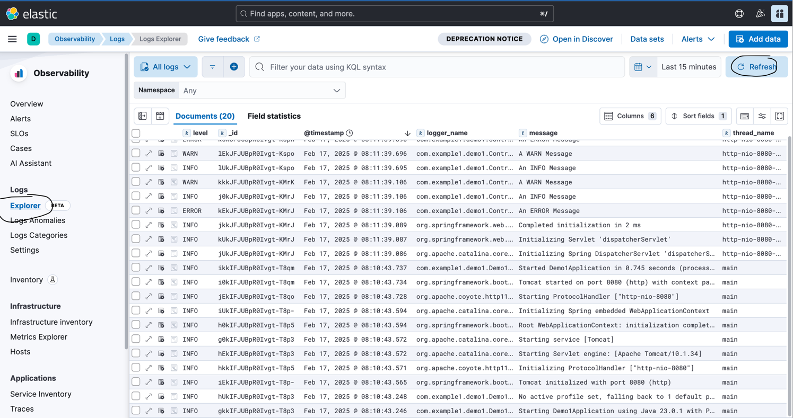

# About this project
This project is a simple Springboot 3 project which send logs via TCP to a logstash server. Once you start all the services needed you should see the logs in Kibana


## How to run
**1. Start elasticsearch:**
elasticsearch comes with security enable by default, that could be a problem if you only want to run and test quickly you application. So first we need to Enable security features in the <ELASTICSEARCH_FILES>./config/elasticsearch.yaml
```
# Enable security features
xpack.security.enabled: false
xpack.security.enrollment.enabled: false
```
**2. Start Kibana**
**3. Start logstash:**
You need to edit you <LOGSTASH_FILES>./config/logstash-sample.conf to tell logstash that the input will be TCP

Content of logstash-sample.conf
```
# Sample Logstash configuration for creating a simple
# Beats -> Logstash -> Elasticsearch pipeline.

input {
  tcp {
    port => 5044
    codec => json_lines  # Use json_lines codec to decode JSON logs
  }
}

filter {
  # Optional: Additional filters can be added here
}

output {
  stdout {
    codec => json
  }
  elasticsearch {
    hosts => ["http://localhost:9200"]
    user => "elastic"
    password => "cT80hm6O"
  }
}
```
4. Run you springboot application. This app has a logback-spring.xml which set up an appender for sending metrics through TCP to the logstash server(12.0.0.1:5044)
```
mvn spring-boot:run
```
5. After running you application you should start to see the logs in kibana, you could invoke the localhost:8080/test endpoint to add more logs


## Links and references
1. https://medium.com/@sovisrushain/monitoring-spring-boot-microservices-logs-with-the-elk-stack-aeeaf3e98d7b